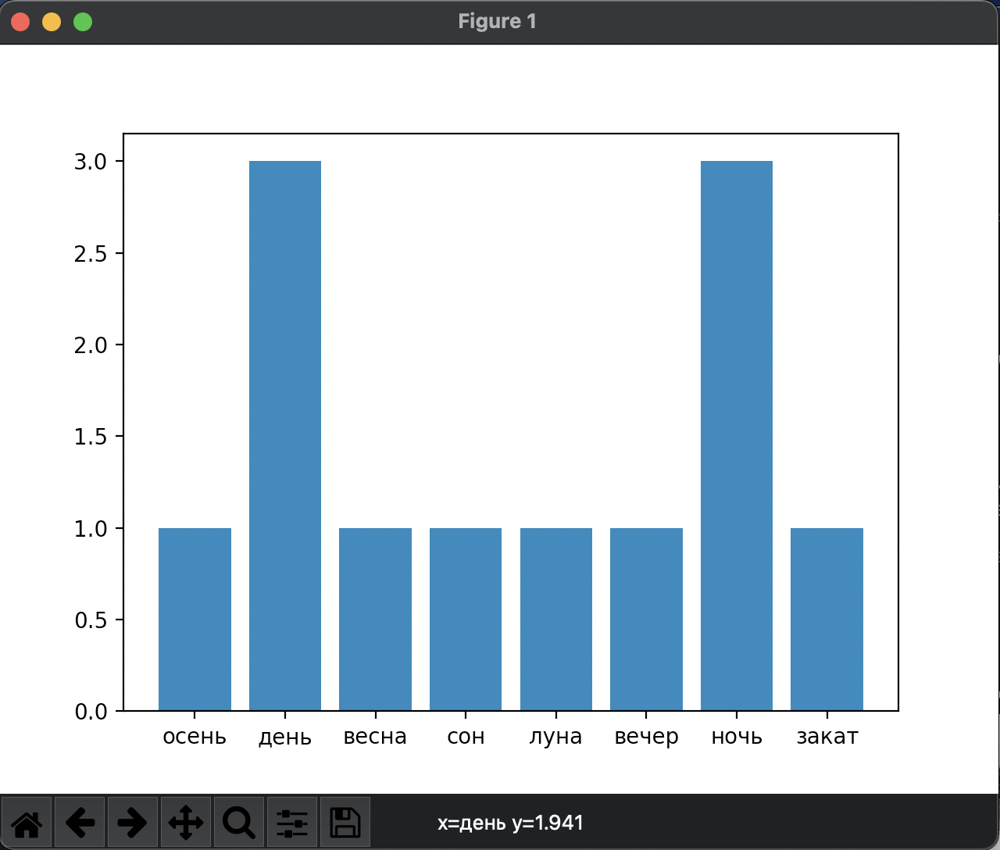

# Проект на тему: 
## Тема
### еще поменьше
#### ehrger

**жирный текст**

<s>strike</s>


1. Применение в задачах в области культурологии
2. ваилвоиамв
3. важрвта

в
врвер


2. Пример работы:

```
print("Hello, world!")
```


3. Я применила 3 библиотеки для решения задачи

**Первая библиотека** - это `regEx`. С помощью нее успешно решаются задачи по шаблонизации данных (как правило текста). Например, ее можно использовать для выделения слов в тексте, игнорируя знаки препинания.
Пример использования:
```
import re
re.split('\W+', text)
```

**Вторая библиотека** - это `pymorphy2`, способная производить подробный морфологический анализ слова. Например, библиотека может выделять начальную форму слова, что и использовалось в проекте.
Пример использования:
```
import pymorphy2
morph = pymorphy2.MorphAnalyzer()
parsed_data = morph.parse('весенняя')
```

**Третья библиотека** - это `matplotlib`, которую используют для визуализации данных двумерной и трехмерной графики. Пакет поддерживает многие виды графиков и диаграмм:

* Графики (line plot)
* Диаграммы разброса (scatter plot)
* Столбчатые диаграммы (bar chart) и гистограммы (histogram)
* Круговые диаграммы (pie chart)
* Ствол-лист диаграммы (stem plot)
* Контурные графики (contour plot)
* Поля градиентов (quiver)
* Спектральные диаграммы (spectrogram)

Пример использования библиотеки для построения столбчатой диаграммы (данные о ценах на продукты):
```
import matplotlib.pyplot as plt

fig, ax = plt.subplots()

ax.bar(['Соль', 'Сахар', 'Овсянка'], [67, 90, 180])

plt.show()
```

**Все вышеупомянутые библиотеки использованы в проекте**  
Пример кода есть в репозитории в файле `project.py`, либо можно пройти по ссылке: [тык](https://github.com/shoshinabeth/project_Shoshina/blob/main/project.py)


4. Анализ результатов

выводы


